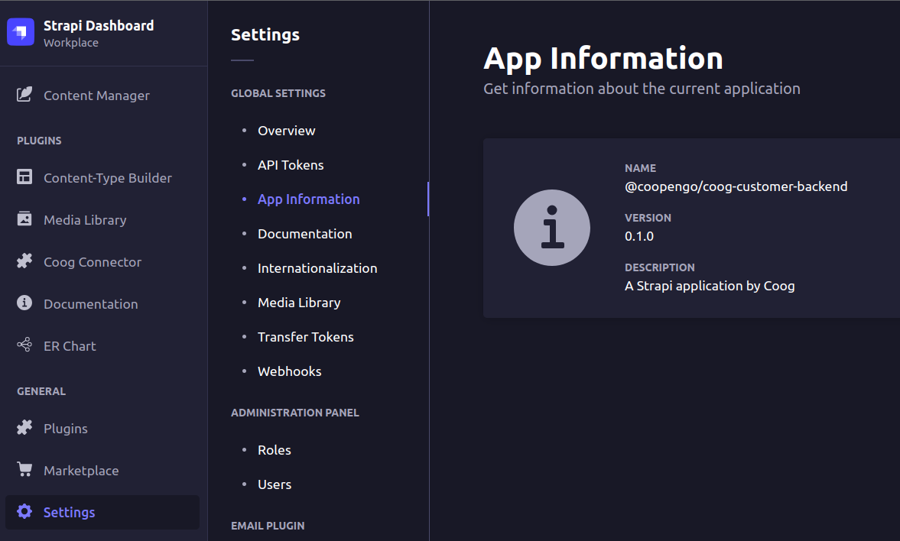

# Strapi app version plugin

This plugin for Strapi 4 allow you to visualize the application information from package.json in the Settings page.



## Installation

```sh
npm install @coopengo/strapi-plugin-app-information
```

or

```sh
yarn add @coopengo/strapi-plugin-app-information
```

To apply the plugin to Strapi run re-build command

```sh
strapi build
```

## Author

[DominiqueBertrand](https://github.com/DominiqueBertrand/)
